# Legacy Customer Lookup Modernization Demo

This repository demonstrates the modernization of a legacy Windows Forms customer lookup application into a modern Blazor web application while sharing a common business/data layer.

The solution showcases:
- Legacy WinForms desktop application
- Modern Blazor web application
- Shared reusable data/service layer
- Basic customer search functionality
- Clean architecture separation
- .NET 8 modernization approach

---

# 🏗 Solution Structure

```text
LegacyCustomerLookup
│
├── CustomerLookup.Blazor
│   ├── Components
│   ├── Pages
│   ├── Program.cs
│   └── Blazor UI Application
│
├── CustomerLookup.WinForms
│   ├── Form1.cs
│   └── Legacy WinForms Application
│
├── CustomerLookup.Shared
│   ├── Data
│   │   └── CustomerService.cs
│   ├── Models
│   │   └── Customer.cs
│   └── Shared reusable business/data layer
│
└── LegacyCustomerLookup.sln
```

---

# Technologies Used

## Backend / Shared Layer
- C#
- .NET 8
- Shared Class Library
- Object-Oriented Design
- Dependency Injection

## Blazor Application
- Blazor Web App (.NET 8)
- Razor Components
- Component-Based Architecture

## WinForms Application
- Windows Forms
- DataGridView
- Event-driven desktop UI

## Tooling
- Git
- GitHub
- Visual Studio 2022
- .NET CLI
- PowerShell

---

# 🚀 Features

## WinForms Application
- Legacy desktop customer lookup screen
- Search customer records
- Display customer data in DataGridView
- Simulates traditional enterprise desktop systems

## Blazor Application
- Modern browser-based customer lookup
- Shared service layer with WinForms app
- Responsive component-based UI
- Demonstrates modernization strategy

## Shared Data Layer
- Reusable customer model
- Shared customer service
- Centralized mock data source
- Eliminates duplicated business logic
  
---

# Architecture Overview

The `CustomerLookup.Shared` project contains:
- Shared customer model
- Shared customer retrieval/search service
- Centralized business logic

Both applications consume the same shared service layer:

```text
WinForms UI
      │
      ▼
Shared CustomerService
      ▲
      │
Blazor UI
```

This demonstrates an enterprise modernization strategy where legacy desktop applications can gradually migrate to modern web technologies while preserving reusable backend logic.

---

# 📦 Getting Started

## 🧰 Prerequisites

Install the following tools before running the solution:

- .NET 8 SDK
- Visual Studio 2022
- Git

Verify .NET installation:

```powershell
dotnet --version
```

Expected output:

```text
8.x.x
```

# Build the Solution

## Open a terminal in the repository root folder and run:

```powershell
dotnet clean
dotnet build
```

# Running the Blazor Application

## ✅ Run the Blazor web application:

```powershell
dotnet run --project CustomerLookup.Blazor
```
Expected output:

```text
Now listening on: https://localhost:xxxx
```

Open the browser using the HTTPS URL displayed in the terminal.

Example:

```text
https://localhost:7185
```

# Running the WinForms Application

## ✅ Run the WinForms desktop application:

```powershell
dotnet run --project CustomerLookup.WinForms
```

This launches the legacy Windows Forms customer lookup application.


---

# Application Screenshots

## Blazor Customer Lookup

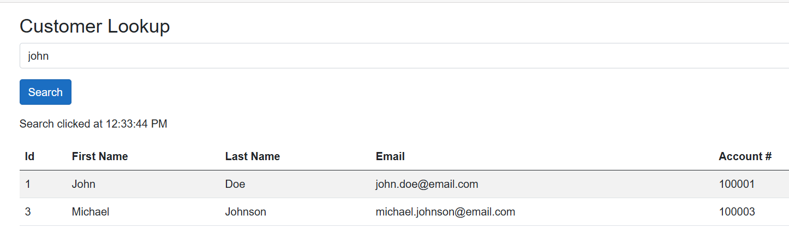

Interactive Blazor Server customer lookup page supporting real-time search against SQL Server-backed customer data using Entity Framework Core and reusable shared service architecture.

---

## Legacy WinForms Customer Lookup

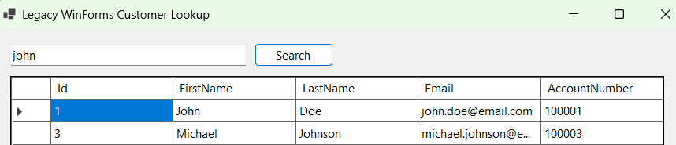

Legacy Windows Forms implementation demonstrating the original desktop-based customer lookup workflow prior to modernization.

---

## SQL Server Customer Data

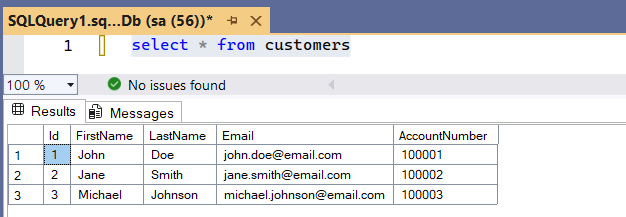

SQL Server persistence layer containing customer records consumed by both WinForms and Blazor applications through a shared Entity Framework Core DbContext and CustomerService layer.

---

# SQL Server Integration

The solution now includes SQL Server integration using Entity Framework Core and a shared reusable data access architecture.

## Features

- Shared Entity Framework Core DbContext
- SQL Server-backed customer persistence
- Reusable CustomerService consumed by both applications
- Interactive Blazor customer search functionality
- Dependency Injection across applications
- Shared business/data architecture
- Centralized customer retrieval logic
- Search filtering by:
  - Customer ID
  - First Name
  - Last Name
  - Email
  - Account Number

## Technologies Used

- SQL Server Express
- Entity Framework Core 8
- .NET 8
- Blazor Server
- Windows Forms
- Dependency Injection
- Shared Service Layer Architecture

---

## Architecture Overview

```text
WinForms UI
      │
      ▼
Shared CustomerService
      │
      ▼
Entity Framework Core
      │
      ▼
SQL Server Database
      ▲
      │
Blazor UI
```
---

# Customer Email Update & Validation Enhancements

The project was enhanced to support inline customer email address updates directly within the Blazor application using SQL Server-backed persistence and enterprise-style validation workflows.

## Features Added

- Inline editable email address fields
- Batch update support for multiple modified email addresses
- SQL Server persistence using Entity Framework Core
- Email format validation
- Unique email address validation
- Automatic focus on invalid email cells
- Visual indicators for modified but unsaved email addresses
- Real-time update feedback and validation messages

## Business Rules Implemented

### Valid Email Address Validation

The system validates that all email addresses entered follow a valid email format before updates are committed to SQL Server.

Examples of invalid values:
- invalid-email
- customer@
- @example.com

### Unique Email Address Validation

The system verifies that each email address is unique across all customer records.

This validation is enforced through:
- Application-level validation
- SQL Server unique index constraint

### User Experience Improvements

- Pressing Enter in the search textbox automatically executes the search
- Modified email addresses display an Unsaved indicator
- Invalid email cells automatically receive focus
- Invalid rows are visually highlighted
- Batch updates allow multiple rows to be updated simultaneously

---

# Validation & Update Workflow Screenshots

Customer records including editable email addresses and account numbers displayed within the interactive Blazor customer lookup grid.


## 1. Blazor Customer Lookup Before Email Updates

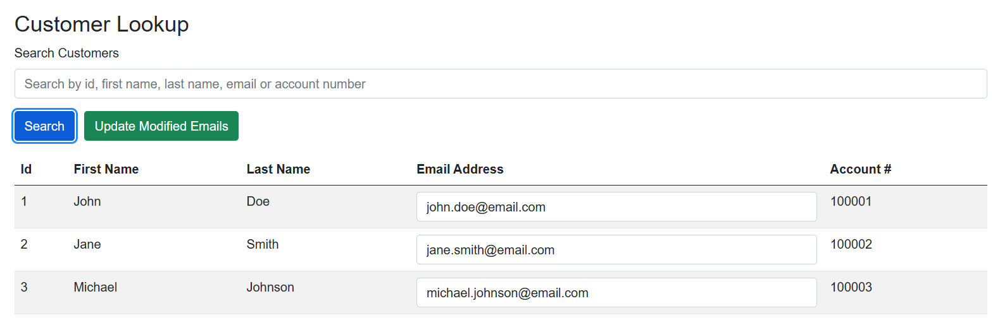

Initial customer lookup screen before email address modifications are applied.

---

## 2. SQL Server Customer Records Before Update

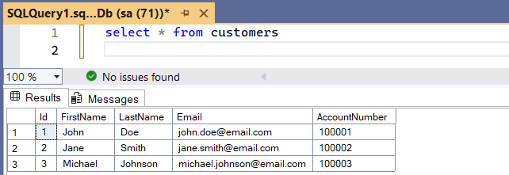

Customer records stored in SQL Server before updates are committed.

---

## 3. Invalid Email Address Validation

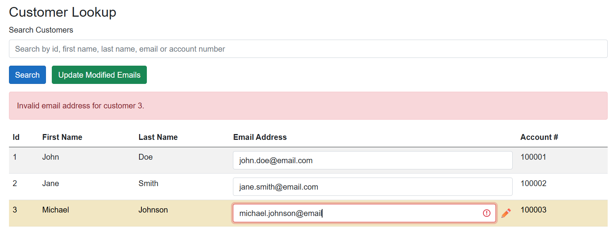

The system validates invalid email formats, displays an error message, highlights the invalid row, and automatically focuses the appropriate email cell.

---

## 4. Duplicate Email Address Validation

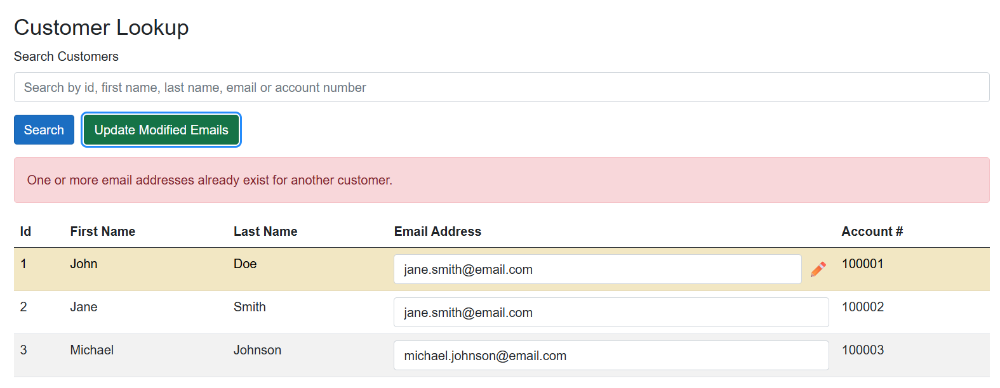

The system prevents duplicate email addresses from being assigned to multiple customers.

---

## 5. Blazor Customer Lookup Before Email modifications are saved

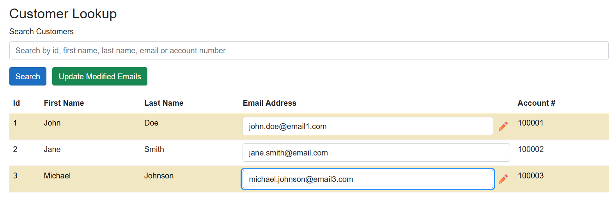

Customer lookup screen showing unsaved email address modifications.

---


## 6. Update Email modifications highlighted

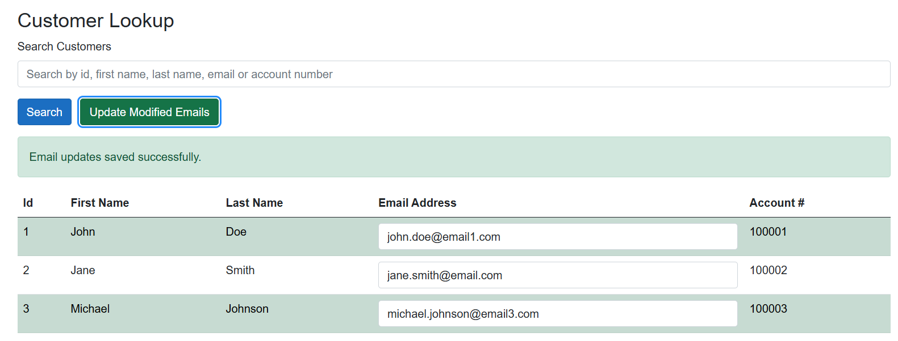

Blazor application highlighting the successful batch email updates.


## 7. Successful Email Address Updates

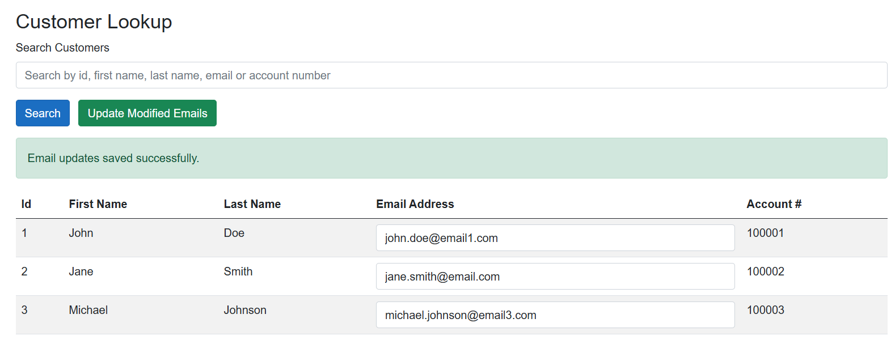

Blazor application displaying successful batch email updates and confirmation message.

---

## 8. SQL Server Records After Update

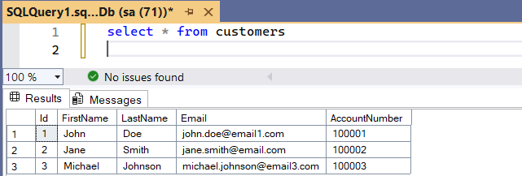

SQL Server customer records after email address updates were successfully committed.

---

# Enterprise Concepts Demonstrated

This enhancement demonstrates several enterprise application engineering concepts:

- Blazor interactive components
- SQL Server integration
- Entity Framework Core persistence
- Shared service-layer architecture
- Business-rule validation
- Batch update workflows
- User experience enhancements
- Inline editable grids
- Focus management and validation UX
- Dependency Injection
- Reusable backend services
- Enterprise modernization architecture patterns


